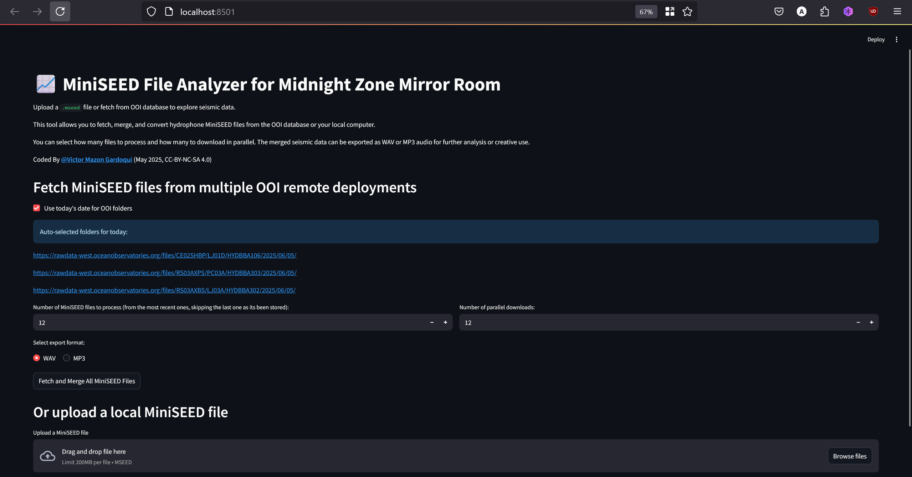

# MiniSEED File Analyzer

A user-friendly tool for exploring, merging, and sonifying hydrophone MiniSEED data from the Ocean Observatories Initiative (OOI).  
**Includes both a web app (Streamlit) and a command-line interface (CLI) for automation and advanced users.**

---

## 🚀 Features

- Fetch MiniSEED files from OOI remote folders (auto-select today's folder or use custom URLs)
- Select how many files to process and how many to download in parallel
- Remove DC offset before export for cleaner audio
- Export merged seismic data as WAV or MP3 (saved to a `sonifications` folder)
- Upload and process local `.mseed` files (web app)
- CLI mode for automated, scheduled sonification (e.g., hourly, at boot)
- Automatic cleanup: deletes sonification files older than 7 days to save disk space

---

## 📸 Screenshots



---

## 🛠️ Requirements

- Python 3.8+
- [ffmpeg](https://ffmpeg.org/download.html) (for MP3 export)
- Install dependencies from `requirements.txt`:

    ```sh
    pip install -r requirements.txt
    ```

---

## 💻 Usage

### Web App (Streamlit)

1. **Clone or download this repository.**
2. *(Optional)* Create and activate a virtual environment:
    ```sh
    python -m venv mseed-analycer
    # Windows:
    .\mseed-analycer\Scripts\Activate
    # macOS/Linux:
    source mseed-analycer/bin/activate
    ```
3. **Install dependencies:**
    ```sh
    pip install -r requirements.txt
    ```
4. **Install ffmpeg** and add it to your system PATH for MP3 export.
5. **Run the app:**
    ```sh
    streamlit run mseed-analycer-app.py
    ```
6. **Open [http://localhost:8501](http://localhost:8501) in your browser.**
7. **Use the app to fetch, process, and export MiniSEED data.**

---

### CLI Mode (Automation & Advanced Users)

The CLI script automatically processes all 5 OOI hydrophone locations for **today's date**.

**Export as WAV:**
```sh
python [mseed-analycer-cli.py](http://_vscodecontentref_/0) --num-files 12 --export-format WAV
```

**Export as MP3 320kbps:**
```sh
python mseed-analycer-cli.py --num-files 12 --export-format MP3
```

- Output files are saved in the `sonifications` folder.
- Schedule this command with your system's scheduler (cron, Task Scheduler, etc.) to run hourly.

---

## 🧹 Automatic Cleanup

The tool automatically deletes files in the `sonifications` folder older than 7 days to save disk space.

---

## 🆘 Troubleshooting

- **MP3 export unavailable:**  
  Ensure `ffmpeg` is installed and available in your system PATH.
- **File not found in browser:**  
  Exported files are saved to the `sonifications` folder next to the script.
- **Permission errors:**  
  Make sure you have write access to the project folder.
- **Virtual environment issues:**  
  Delete and recreate your virtual environment if you see strange errors.

---

## 🤝 Contributing

Pull requests and suggestions are welcome!  
Please open an issue or discussion for feedback or questions.

---

## 📄 License

CC-BY-NC-SA 4.0

---

## 👤 Author

Coded By [@Victor Mazon Gardoqui](https://github.com/rvx) (May 2025)  
Thanks to Julian Charrière, Deborah Kelley, Joe Duprey, Bret Nestor

